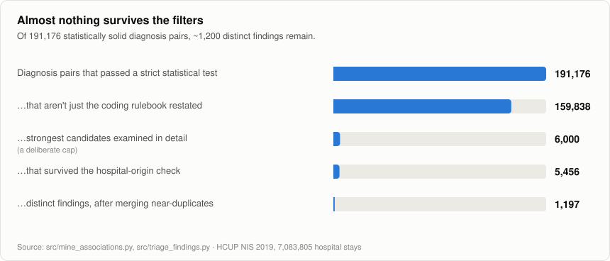
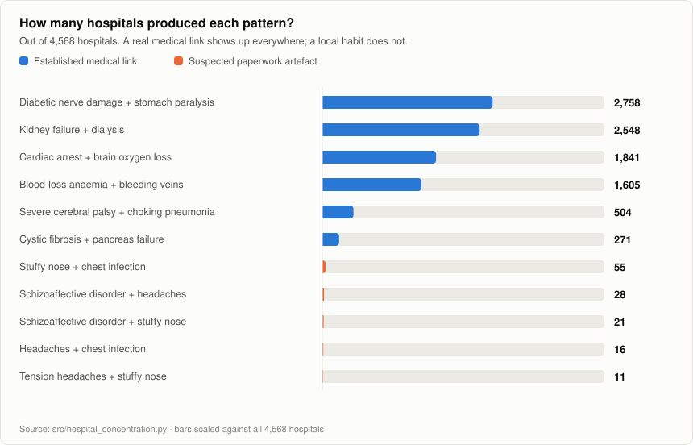
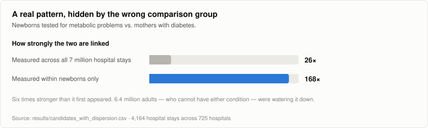
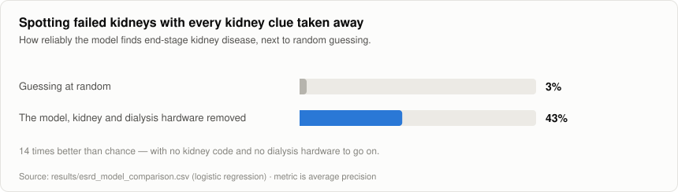
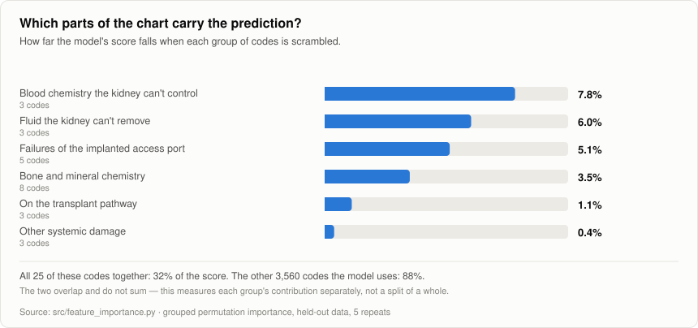
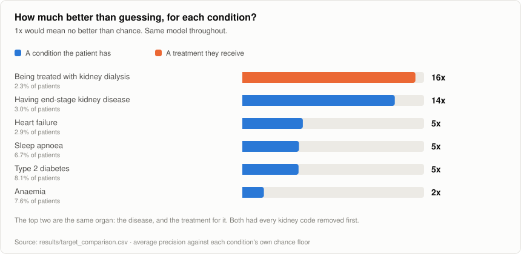

# What co-occurs with what: 7 million hospital records

No medical or statistics background needed to read this.

## The data

Every time someone is admitted to a US hospital and later discharged, the
hospital records what was wrong with them — not in sentences, but as codes.
"Type 2 diabetes with kidney complications" is `E11.22`. "Dependence on renal
dialysis" is `Z99.2`. About 73,000 of these codes exist, and a typical hospital
stay is tagged with around twelve of them.

This project uses the **HCUP National Inpatient Sample 2019**: **7,083,805
discharge records**, about one in five hospital stays in the country that year,
carrying **86 million individual diagnosis codes**.

**The data file is not in this repository and never will be.** It is
restricted-use federal data, released only under a signed Data Use Agreement
that forbids redistributing patient-level records to anyone who has not signed
their own. Publishing it — to a public repo *or* a private one — would breach
that agreement. It is de-identified, so this is not a HIPAA matter, but it is a
legal one.

Everything in `results/` is aggregate and passes the agreement's cell-size rule
(no figure may rest on 10 or fewer patients), so the findings are readable
without the data. Reproducing them requires your own DUA with AHRQ.

Three things keep the data out of this repo: a `.gitignore` covering the raw
file and everything derived from it, a pre-commit hook that blocks the commit
if a restricted file is staged or a notebook still has saved output, and a
tool that strips those outputs. That middle one matters most — the real
exposure risk is not the 2 GB data file, which is obvious, but notebooks:
running a cell that prints a dataframe saves those rows *inside* the `.ipynb`,
so a file that looks like source code can carry hundreds of patient records.

The hook lives in `.git/hooks/`, which git does not track. After cloning, run
`bash tools/install_git_hooks.sh` or that layer is missing.

## What the project was trying to do

A simple question: **which diagnoses show up together more often than you'd
expect by chance?**

This is the same question Amazon asks about products. If people who buy a tent
also tend to buy a sleeping bag, that's worth knowing. The technique is called
association mining, and it works the same way whether the basket holds camping
gear or diagnoses.

With 7 million hospital stays, the hope was that the data might reveal
connections between conditions that people hadn't noticed.

## Filtering out the false leads

Finding pairs that occur together is easy. Almost all of them are junk, and the
work is in removing the junk without also removing the real findings.



Reading that chart from top to bottom:

- **191,176 pairs passed a strict statistical test.** Co-occurrence counts for
  every possible pair of codes come from a single large matrix multiplication
  over all 7 million records. A pair only counts if it appears together far
  more often than chance predicts *and* clears a significance threshold
  tightened to account for the sheer number of pairs being tested at once —
  test enough combinations and thousands will look remarkable by luck alone.

- **159,838 aren't just the coding rulebook restated.** Many code pairs are
  guaranteed to appear together because the rules say so. "Dialysis dependence"
  and "end-stage kidney disease" is not a discovery — dialysis is the treatment
  *for* kidney failure, and coders are instructed to record both. Same for
  hamburger-buns-and-hamburgers pairs like a birth-related tear alongside a code
  that literally means "single live birth". These get flagged automatically by
  reading each code's own description, and set aside.

- **6,000 strongest candidates examined in detail.** A deliberate cap — the
  remaining checks are slower, so they run on the strongest candidates rather
  than all 159,838.

- **5,456 survived the hospital-origin check.** Explained below.

- **1,197 distinct findings.** Many surviving pairs are the same medical story
  told at slightly different levels of detail — diabetes-with-complication-A
  alongside kidney-stage-3, then stage-4, then stage-5. Merging those leaves
  about 1,200 genuinely separate findings.

## Finding 1: nearly everything real was already known — and the exceptions were fake

Once the artefacts were stripped out, the strongest surviving connections were
things like cystic fibrosis with pancreatic failure, diabetic nerve damage with
a stomach-emptying disorder, and severe bedsores with bone infection at the same
site. All well documented. No surprises.

**That is a good result, not a disappointing one.** A measuring instrument that
gets the verifiable things right is one you can trust elsewhere. If the method
had instead produced a pile of shocking new medical claims, the correct reaction
would be that the method is broken.

Which leaves the handful of pairs that *weren't* medically recognised. The
strongest was **tension headaches and chronic stuffy nose** — a link nothing
obvious explains, which survived every quality check. By the numbers, the single
most interesting result in the dataset.

So one more question: which hospitals is it coming from?



The dataset covers **4,568 hospitals**. That pattern came from **eleven**.

Some hospitals copy a patient's entire history of minor ongoing complaints onto
the record even when the admission is for something unrelated. At those
hospitals, a set of unconnected background problems gets written down together
over and over, and ends up looking statistically inseparable.

The top six bars are relationships nobody disputes, used to check the test was
calibrated; the bottom five are the suspicious ones. You don't need statistics
to see the difference. Applied to every candidate, **9.1% failed** — and the
failure rate was *higher* among the top-ranked results, because a quirk
concentrated in a few hospitals is exactly what produces an extreme-looking
number.

None of the standard statistical tools can catch this. A real medical link and a
local paperwork habit produce identical-looking output. The only way to tell
them apart is to ask where the records came from.

## Bonus finding: some real patterns are hidden by the wrong comparison group

Newborns get tested for metabolic problems when their mother has diabetes. That
link looks moderately strong in the raw numbers — and about six times stronger
once you compare newborns only against other newborns.



Roughly 600,000 records here are newborns; 6.4 million are adults. A pattern
that can only exist among babies gets averaged against millions of adults who
couldn't possibly have it, and comes out looking weaker than it is.

This is worth flagging because it runs backwards from what people expect. The
usual worry is that a statistic looks *stronger* than reality, so analysts
discount big numbers. Here the raw figure was too *small*. Twenty-two other
pairs in this dataset had the same thing happen, and there are almost certainly
more — any condition confined to one age group, one sex, or one narrow patient
population will be understated the same way whenever it's measured against
everybody. It's likely a more common problem than it gets credit for.

## Building a model to predict a diagnosis

The second half of the project: pick one diagnosis code, and see whether it can
be predicted from the *other* codes on the same record.

The code chosen was **`Z99.2` — dependence on renal dialysis**. It appears on
2.37% of hospital stays.

That number matters immediately. A "model" that answers *no* to everyone, every
time, is right 97.6% of the time and has learned nothing. So accuracy is useless
here, and the model is scored on how well it picks dialysis patients out of the
crowd, against a random-guessing floor.

The first attempt scored extremely well — and it was cheating. Its most powerful
clue was a code meaning *"patient's noncompliance with renal dialysis."* You
cannot skip a dialysis appointment if you aren't on dialysis. Several other top
predictors were codes the rulebook *requires* to be recorded alongside `Z99.2`.
The model wasn't diagnosing anyone; it was noticing that the chart already said
"dialysis" a few columns over — like predicting who owns a car by checking
whether they have car insurance. This is called **target leakage**, and it is
the most common way a medical prediction model produces a number that falls
apart in the real world.

So every kidney- and dialysis-related code was removed, and the model was fit
again from scratch.



**This is the result worth reporting.** With no kidney reference of any kind
available, the model still identifies dialysis patients roughly 16 times better
than chance. It does it by recognising the body-wide damage that kidney failure
causes.

### What "37%" actually means

It does **not** mean the model is right 37% of the time. The model never gives a
yes-or-no answer at all. It scores every patient and puts them in order, most
likely to least likely, and the 37% measures how good that ordering is.

Here is the same thing without any statistics. The held-out set has 150,000
patients, of whom 3,526 — about 1 in 43 — are on dialysis. Pick 1,000 of them:

| Take 1,000 patients… | How many are really on dialysis |
|---|---|
| picked at random | about **24** |
| the 1,000 the model ranks highest | **593** |

Same pool, same 1,000 people pulled out of it. That gap is what the model is
worth.

The 37% is that hit rate averaged over the whole ranking rather than just the
top 1,000. It runs at 69% among the top 100, 59% by the top 1,000, and 35% by
the top 5,000, falling as you dig deeper to scrape up the last few dialysis
patients. Guessing at random scores 2.3% at *every* depth, because any random
handful of patients is 2.3% dialysis. 37 ÷ 2.3 ≈ **16 times better than
chance**, and every figure below uses that same framing so the numbers can be
compared to one another.

Where you would actually draw the line — flag the top 100? the top 5,000? — is a
separate decision, trading false alarms against missed patients. The 37% is
deliberately independent of that choice.

### How much does each part of that damage actually contribute?

The obvious way to answer this is to look at the model's coefficients, but they
answer a subtly different question — the effect of one code *holding the others
fixed*, which understates a group of codes that move together. Instead, each
group is **scrambled**: its values are shuffled across patients, destroying that
group's link to the outcome while leaving everything else alone, and the drop in
the model's score is measured.



- **Blood chemistry the kidney can't control (7.8%)** — potassium and acid
  building up in the blood. This is the single biggest named signal, and it is
  the most direct: it's the thing dialysis is *for*.
- **Fluid the kidney can't remove (6.0%)** — water that has nowhere to go.
- **Failures of the implanted access port (5.1%)** — dialysis needs a permanent
  surgical connection into a blood vessel, and those bleed, clot, narrow, and
  get infected. The model picks up all four.
- **Bone and mineral chemistry (3.5%)** — failing kidneys stop regulating
  calcium and phosphate, and the skeleton pays for it.

**The honest caveat, which the chart makes plain:** those 25 codes together
account for about a third of the model's score. The remaining ~3,560 codes it
uses account for most of the rest. So the clean clinical story above is the
*strongest and most interpretable* part of the signal, not the whole of it —
the model is mostly drawing on a very large number of individually weak clues.
Naming four groups and stopping there would have overstated how tidy it is.

### Is dialysis the best condition to try this on?

Not necessarily — so the same model was run against six other diagnoses, chosen
to span easy and hard, common and rare.



**Severe sepsis with septic shock is the better showcase.** It beats dialysis,
and its explanation is far cleaner: the model spots it through severe infections
(peritonitis, necrotising fasciitis, cholangitis) and the organ failures they
trigger (blood-clotting collapse, respiratory failure). That is a *causal* story
a clinician would recognise instantly. Dialysis dependence, by contrast, is an
administrative status code — the model reaches it through the wreckage that
surrounds it, which is interesting but indirect.

**The bottom of the chart is as informative as the top.** Anaemia manages only
twice chance. That is not a failure of the model; it is a fact about the
condition. Anaemia turns up in almost every kind of patient for almost every
reason, so the rest of the chart barely narrows it down. Severe sepsis and
dialysis are predictable precisely because they leave a specific, systemic mark
on everything else recorded. Being a smoker sits near the bottom for a different
reason — it is a behaviour, not a physiological state, so the body does not
necessarily show it.

Dialysis is shown here under the stricter, condition-specific clue filter, the
same one behind the 16x above. The other six use the automatic filter, which is
blunter. If dialysis were given that blunter treatment it would score about 32x,
and the number would be worse — it would be counting kidney codes the automatic
rule failed to spot as giveaways.

## What this cannot tell you

- **These are hospital stays, not people.** There's no patient identifier, so
  someone admitted three times in 2019 appears as three unrelated records.
- **Two things on the same chart doesn't mean one caused the other.** It can be
  a shared underlying cause, a billing incentive to record both, or — as Finding
  1 shows — one hospital's habit.
- **Only age and sex were adjusted for.** Not income, insurance, or region.
- **The data flags whether a condition was present on arrival, and I didn't use
  it.** That would separate "these go together in patients" from "one happened
  *during* the stay" — a different claim, and the biggest available improvement
  to this work.

## Running it

```bash
python src/build_transactions.py     # .SAV -> sparse matrix, ~3 min
python src/mine_associations.py      # pair mining over all 7.08 M discharges
python src/hospital_concentration.py # is it clinical, or one hospital's habit?
python src/triage_findings.py        # collapse to a reviewable shortlist
python src/predict_dialysis.py       # the model, under three leakage regimes
python src/feature_importance.py     # what carries the prediction
python src/compare_targets.py        # the same model against six other diagnoses
python tools/make_figures.py         # regenerate the charts above
```

Dependencies: `pandas`, `numpy`, `scipy`, `scikit-learn`, `pyreadstat`.

```
src/          the pipeline
tools/        figure generator, notebook output stripper, pre-commit leak guard
figures/      the charts above, regenerated from results/
results/      aggregate, cell-suppressed findings (safe to publish)
*.ipynb       the same analyses as annotated notebooks, in reading order
```

The full ranked tables behind every figure are in `results/`.
